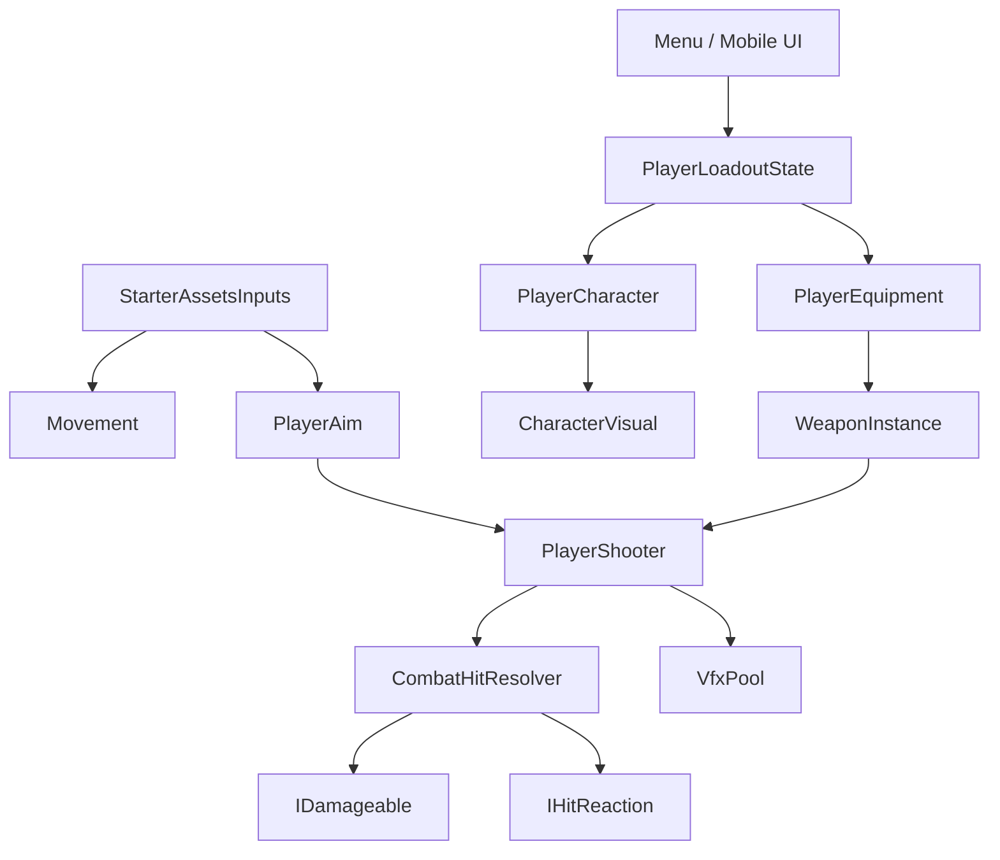
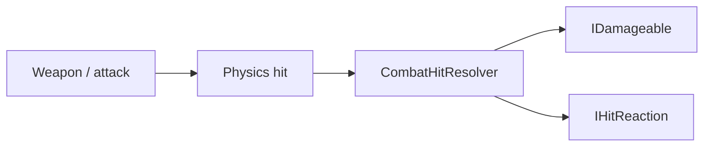

# 🏗️ Architecture

← [Back to README](../README.md)

## Big picture



---

## Player

### `PlayerCharacter`
Owns the active gameplay character visual.

**Responsibilities**
- Spawn selected character
- Swap `CharacterVisual`
- Expose `ActiveVisual`
- Use scene fallback when no menu loadout exists

### `CharacterVisual`
Character-specific presentation/data required by reusable systems.

Typical important references:

```text
Animator
WeaponSocket
AuraColor
```

**Rule:** character-specific visuals live here; global player mechanics do not.

---

## Equipment

### `PlayerEquipment`
Owns the currently equipped gameplay weapon.

Uses:

```text
WeaponItemData
↓
equippedPrefab
↓
WeaponInstance
↓
CharacterVisual.WeaponSocket
```

### `WeaponInstance`
Single source of truth for equipped-weapon attachment.

Typical references:

```text
GripPoint
Muzzle
optional PlasmaCoreSetup
```

Both gameplay and menu preview use this attachment path.

---

## Loadout

### `PlayerLoadoutState`

```text
IsInitialized
SelectedCharacter
SelectedWeapon
```

Meaning:

```text
IsInitialized = false
→ scene launched directly
→ use scene defaults

IsInitialized = true
SelectedWeapon = null
→ player explicitly selected NONE
```

Future optional slots (grenade, gadget, etc.) should follow the same idea.

---

## Menu

Two separate states are intentional:

**Browsed item** = what the player is looking at.  
**Selected item** = what actually enters the loadout.

### Browse mode

```text
< TYPE >
< ITEM >
SELECT
PREVIEW
PLAY
EXIT
```

### Preview mode

```text
< TYPE >
< ITEM >
SELECT
PREVIEW  [disabled]
PLAY
BACK
```

Browsing remains active. `SELECT` updates the combined preview immediately.

---

## Combat

Generic flow:



### `IDamageable`
Raw gameplay damage.

Examples:
- Player health
- Enemy health
- Future boss/destructible health

### `IHitReaction`
Hit behavior separate from health.

Example:
- practice target piece punch-out when the visual plasma bolt arrives

**Rule:** weapons do not know concrete target classes.

---

## Shooting

Current plasma model:

```text
input
↓
Physics.Raycast
↓
instant gameplay damage
↓
visual bolt travels
↓
impact VFX on visual arrival
```

The visual bolt is not authoritative gameplay physics.

---

## Aim

`PlayerAim` centralizes:
- desktop aim
- mobile auto-aim
- target registry
- camera visibility
- LOS
- sticky lock
- target switching
- free-look
- mobile shot accuracy

`AimTarget` marks valid target roots.

**Do not duplicate aim/LOS rules inside each weapon.**

---

## Input

```text
Desktop / Mobile source
↓
StarterAssetsInputs
↓
shared gameplay systems
```

Input source may differ. Gameplay behavior should remain shared whenever practical.

---

## VFX

High-frequency effects use:

```text
VfxPool.Spawn
↓
play
↓
VfxPool.Release
↓
reuse
```

Current pooled effects:
- plasma bolt
- muzzle
- impact

PlasmaCore procedural arcs manage/reuse their own objects separately.

---

## Enemy direction

Preferred principle:

> **Inheritance = what an enemy is. Components = what an enemy can do.**

Reusable capabilities should eventually cover:
- health
- navigation
- targeting
- LOS
- shooting
- hit reactions
- `AimTarget`

Do not copy/paste separate LOS implementations into every enemy.
