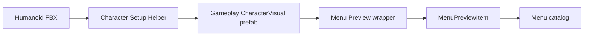
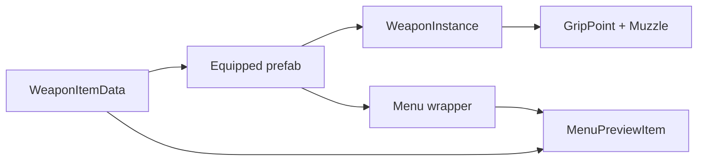

# 🧰 Common Workflows

← [Back to README](../README.md)

## 👤 Adding a character

### Preferred flow



### Requirements

The FBX must map successfully to a Unity **Humanoid** avatar.

Source does **not** have to be Mixamo. Blender, Meshy, Tripo, Asset Store, or custom rigs are fine if Unity can resolve the humanoid skeleton.

### Verify after creation

- Humanoid avatar is valid
- Animator reference
- `WeaponSocket`
- Aura color
- menu wrapper
- `MenuPreviewSettings` is on the wrapper
- `MenuPreviewItem.characterPrefab` points to gameplay prefab

### Important

`WeaponSocket` may need manual per-character tuning.

Normal repair/setup should preserve an existing gameplay prefab. If you delete and rebuild the prefab, hand-tuned socket placement can be lost.

---

## 🔫 Adding a weapon

### Flow



### Equipped prefab must have

```text
WeaponInstance
├── GripPoint
├── Muzzle
└── optional visual setup
```

### Menu item

A weapon `MenuPreviewItem` points to:
- `previewPrefab` → menu presentation
- `weaponItemData` → actual gameplay data

### NEVER

Do not manually recreate attachment math in new systems. `WeaponInstance` already owns it.

---

## 👾 Adding an enemy

For prototypes, prioritize **behavior over final art**.

A useful enemy should be composed from reusable capabilities:

```text
Enemy
├── Health / IDamageable
├── AimTarget
├── navigation / movement
├── targeting / LOS
├── attack behavior
└── hit/death feedback
```

Near-term goal:
- one aggressive/rusher enemy
- one enemy with a clearly different role, likely ranged

Enemies should navigate and threaten the player rather than simply pushing into walls.

---

## 🗺️ Starting a real level

1. Duplicate a known-good gameplay scene.
2. Rename it, e.g. `Level01_Prototype`.
3. Keep:
   - Player
   - camera
   - input
   - mobile controls
   - required managers
   - baseline volume/lighting
   - wall fade setup
4. Remove:
   - practice targets
   - rails
   - debug props
   - experiment-only systems
5. Greybox before making final environment art.
6. Build a small playable sequence first.
7. Test camera/movement inside real encounters.

Do not build a massive map before the first 3–5 minute sequence is fun.

---

## 🚫 Creating a NONE loadout item

For optional slots:

```text
Display Name      NONE
Type              Weapon / future optional type
Clears Slot       true
Gameplay ref      null
```

Selecting NONE intentionally clears that slot.

Characters are currently mandatory.

---

## 🛠️ Editor helpers

A reusable helper should be designed around:

```text
find existing
↓
create missing
↓
repair/update references
↓
preserve hand tuning
```

Every helper should make these points obvious in either its UI or source header:

- INPUT
- CREATES
- UPDATES
- SAFE TO RERUN?
- MANUAL VALUES PRESERVED?
