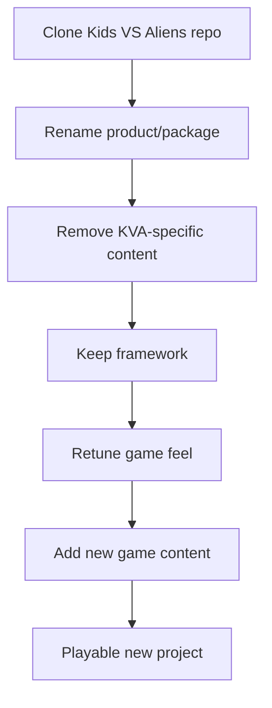

# 🧱 Reusing This Project as a Framework

← [Back to README](../README.md)

## Goal

This repository should eventually let us start a future game like this:



The framework is not intended to be a generic engine for every possible genre.

It is a **battle-tested starter for games that benefit from these systems**.

---

## Usually keep

```text
Player prefab/core
movement
camera base
desktop/mobile input architecture
CharacterVisual
PlayerCharacter
PlayerEquipment
PlayerLoadoutState
WeaponInstance
aim architecture
combat hit abstraction
VfxPool
menu/loadout framework
graphics/settings framework
common helpers
```

---

## Usually replace

```text
Amy
Sporty Granny
aliens
KVA weapons/art
KVA levels
KVA story/lore
KVA UI art
KVA progression
alien-specific VFX/audio
practice range if irrelevant
```

---

## Reusable but retune

Do not blindly inherit game feel.

Always retest:
- movement speed
- acceleration
- camera angle/distance
- aim assist
- auto-aim
- free-look behavior
- weapon feel
- quality presets
- UI layout

The code can survive while the values change dramatically.

---

## Framework quality bar

A reusable system should:
- have one clear responsibility
- expose useful data instead of requiring hierarchy searches everywhere
- avoid hard-coded game-content references
- survive swapping characters/weapons
- work on mobile
- be understandable by another developer
- be documented at the usage level
- have a quick smoke-test path

Do **not** generalize something only because it might theoretically be useful someday.
