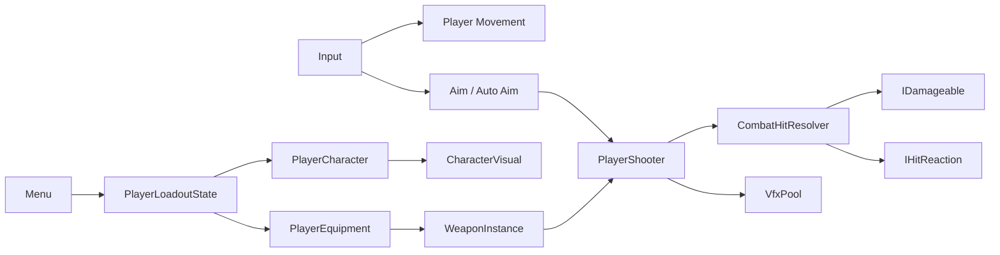
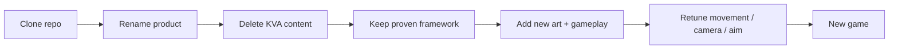

# 👾 Kids VS Aliens

> **A mobile-first Unity game and reusable game framework.**
>
> Build **Kids VS Aliens** now. Reuse the proven core later by cloning the project, deleting game-specific content, and starting the next game with movement, camera, input, combat, loadouts, pooling, menu flow, and tooling already working.

---

## 🚀 New developer? Start here

**You should be productive within ~15–30 minutes.**

1. Open the project in the Unity version used by the repo.
2. Open **`GamePoc`**.
3. Press Play and test:
   - movement / jump / sprint
   - camera
   - weapon equip + shooting
   - enemy / target damage
4. Open the **Menu** scene and test:
   - Character / Weapon browsing
   - `SELECT`
   - `PREVIEW`
   - `NONE`
   - `PLAY`
5. Read:
   - [Architecture](docs/01-ARCHITECTURE.md)
   - [Common Workflows](docs/02-WORKFLOWS.md)
   - [Core Gameplay Systems](docs/03-GAMEPLAY-SYSTEMS.md)
6. Before touching framework code, read the **Do / Don't** table below.

---

## 🧭 Project map



### The important split

| **Framework — keep/reuse** | **Kids VS Aliens — replace/remove** |
|---|---|
| Movement | Amy / character art |
| Camera base | Aliens |
| Desktop + mobile input | KVA weapons/art |
| Aim / auto-aim architecture | Practice range if unwanted |
| Character swapping | Story / lore |
| Equipment + loadout | Levels |
| Combat hit abstraction | KVA progression |
| VFX pooling | KVA UI artwork |
| Menu/loadout framework | Alien-specific content |
| Quality/settings architecture |  |

---

## 🧪 Scenes

### `GamePoc`
Permanent developer sandbox.

Use it for:

`movement` · `camera` · `aim` · `weapons` · `enemies` · `physics` · `VFX` · `performance`

**Do not turn `GamePoc` into Level 1.**

### Real game scenes

```text
GamePoc              ← sandbox
Level01_Prototype    ← real gameplay development
Level01
Level02
...
```

Duplicate a known-good base scene, keep the framework objects, then remove practice/debug content.

---

## 🧩 Core systems at a glance

| System | Owns |
|---|---|
| `PlayerCharacter` | Active `CharacterVisual` |
| `CharacterVisual` | Animator, WeaponSocket, AuraColor |
| `PlayerEquipment` | Equip / unequip `WeaponItemData` |
| `WeaponInstance` | GripPoint → WeaponSocket attachment |
| `PlayerLoadoutState` | Selected character / weapon |
| `PlayerAim` | Aim, auto-aim, target selection, free-look |
| `PlayerShooter` | Firing + hit resolution entry point |
| `CombatHitResolver` | Generic hit / damage dispatch |
| `IDamageable` | Gameplay damage receiver |
| `IHitReaction` | Physical / visual hit reaction |
| `VfxPool` | Reusable high-frequency VFX |
| `MenuController` | Browse / select / preview / play flow |
| `MenuPreviewStage` | Single-item + combined loadout preview |

Full explanation → [Architecture](docs/01-ARCHITECTURE.md)

---

## 🛠️ Common tasks

### Add a character
`Humanoid FBX → Character Setup Helper → gameplay prefab → menu wrapper → menu item`

➡️ [Character workflow](docs/02-WORKFLOWS.md#-adding-a-character)

### Add a weapon
`WeaponItemData → Equipped prefab + WeaponInstance → menu wrapper → menu item`

➡️ [Weapon workflow](docs/02-WORKFLOWS.md#-adding-a-weapon)

### Add an enemy
Build behavior from reusable pieces: health, targeting, LOS, navigation, shooting, `AimTarget`.

➡️ [Enemy workflow](docs/02-WORKFLOWS.md#-adding-an-enemy)

### Add a new level
Duplicate a known-good gameplay scene, preserve framework objects, remove sandbox content.

➡️ [Level workflow](docs/02-WORKFLOWS.md#-starting-a-real-level)

---

## ✅ Do / ❌ Don't

| ✅ Do | ❌ Don't |
|---|---|
| Use `CharacterVisual` for swappable characters | Put player logic inside Amy |
| Use `WeaponInstance` for weapon attachment | Reimplement GripPoint alignment |
| Use `WeaponItemData` | Hard-code Plasma Pistol into generic code |
| Use `CombatHitResolver` / interfaces | Add `if EnemyHealth`, `if BossHealth` inside weapons |
| Use `VfxPool` for repeated VFX | Instantiate/Destroy plasma VFX every shot |
| Keep menu presentation in wrappers | Put `MenuPreviewSettings` on gameplay characters |
| Profile real hardware | Optimize because something *sounds* expensive |
| Keep `GamePoc` as sandbox | Build the real game inside `GamePoc` |
| Test Android | Assume Editor behavior == device behavior |
| Use `Resources` intentionally | Dump random assets into `Resources` |

---

## 📱 Mobile-first rules

- Android/iOS behavior is a first-class target.
- Keep gameplay logic shared between desktop/mobile where possible.
- Test multitouch and auto-aim on device.
- Profile before optimizing.
- Prefer cached / non-alloc patterns in hot loops.
- Triangle count alone does **not** determine mobile suitability.

Current baseline device: **OnePlus Nord 3**.

More detail → [Performance & Testing](docs/04-PERFORMANCE-TESTING.md)

---

## 🧱 Framework philosophy

This repository is intentionally becoming the starting point for future games.

Future workflow:



More detail → [Framework Reuse](docs/05-FRAMEWORK-REUSE.md)

---

## 🎮 Current development direction

Foundation is largely proven. Current focus is shifting to **actual game creation**:

```text
story premise
↓
first playable area
↓
two real enemy behaviors
↓
real encounter
↓
camera / movement validation
↓
rifle / grenade / melee
↓
first 3–5 minute sequence
↓
expand incrementally
```

Current design notes → [Current Direction](docs/06-CURRENT-DIRECTION.md)

---

## 🧪 Before a core commit

Run the short smoke checklist:

- Menu selection / Preview / NONE / Play
- Movement / jump / sprint
- Character + weapon spawn
- Shooting + VFX
- Enemy damage
- Practice target hit
- Near-wall muzzle safety
- Aim / target switching
- No obvious console errors

Before milestones/releases: **test Android too**.

Full checklist → [Performance & Testing](docs/04-PERFORMANCE-TESTING.md)

---

## 📚 Documentation rule

Document **how systems are meant to be used**, not every method.

When adding a reusable system, answer only:

1. What does it own?
2. How do I use it?
3. What must not bypass it?
4. How do I extend it?
5. Framework or game-specific?

If this README becomes huge again, move detail into `/docs` and link it here.
